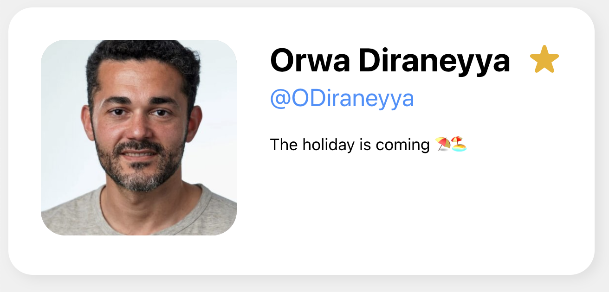

# Backend for Contact-Card Application

This is an _ExpressJS_ application that serves a single GET endpoint (`/api`).

The application is deployed on render, with the endpoint being accessible at the following URL:
https://contactcard-backend.onrender.com/api

The endpoint responds with a constant JSON object containing the following fields:
- `first`: the first name of the person
- `last`: the last name of the person
- `twitter`: the twitter handle of the person
- `avatar`: a URL of an image (i.e. an avatar) of the person
- `notes`: a short description

The JSON is fetched from the frontend's React application and used to display a simple contact card:
